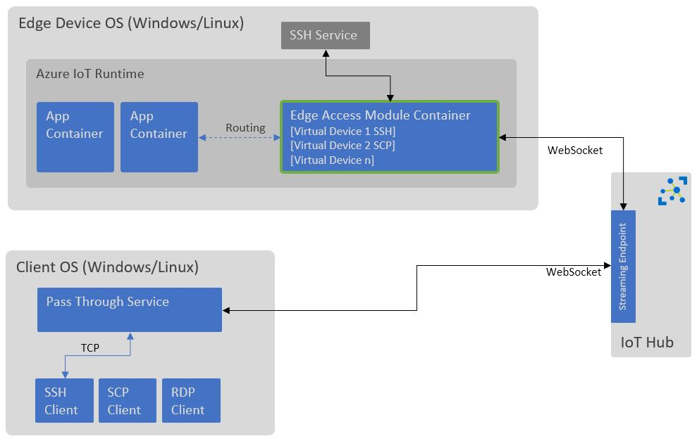

# IoT Edge Secure Remote Access 

This is a solution for IoT Edge module which allows remote access by using device stream feature of IoT Hub. Module runs IoT device virtually on the edge device which takes advantage of the security features of device stream. Both clients and Edge/Device makes outbound connection to the streaming endpoint of IoTHub, no inbound connection is made to either client or Edge/Device. It uses WebSockets to stream binary data between clients and the edge device.

Features-
1. JIT Access.
2. Auditing.
3. Secure Access via Device Stream.

Surface Attack Area-
In this instance access to your Edge device is delegated to IoT Hub. It is therefore important to ensure you take care before granting service connect access permission to any clients, follow a principle of least prevlidge.

To learn more about device stream feature, see here-
https://docs.microsoft.com/en-us/azure/iot-hub/iot-hub-device-streams-overview
